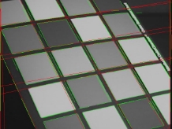

16-385 Computer Vision, Fall 2023

Programming Assignment 1        Image Filtering and Hough Transform

Due Date: Wed September 20, 2023 23:59 (ET)

In this assignment, you will be implementing some basic image processing algorithms and putting them together to build a Hough Transform based line detector. Your code will be able to fit lines to edges in images. We have included a number of images for you to test your line detector code on. Like most vision algorithms, the Hough Transform uses a number of parameters whose optimal values are (unfortunately) data dependent, that is, a set of parameter values that works really well on one image might not be best for another image. By running your code on the test images you will learn about what these parameters do and how changing their values effects performance.

Many of the algorithms you will be implementing as part of this assignment are functions in OpenCV (Open Computer Vision Library). You are not allowed to use calls to these functions in this assignment, unless otherwise specified. You may, however, compare your output to the output generated by these functions to make sure you are on the right track.

1  Instructions
1. Integrity and collaboration: Students are encouraged to work in groups but each student must submit their own work. If you work as a group, include the names of your collaborators in your write up. Code should NOT be shared or copied. Please DO NOT use external code unless permitted. Plagiarism is strongly prohibited and may lead to failure of this course.
1. Start early! Especially those not familiar with Python.
1. Questions: If you have any questions, please look at Piazza first. Other students may have encountered the same problem, and it may be solved already. If not, post your question on the discussion board. Teaching staff will respond as soon as possible.
1. Write-up: Your write-up should mainly consist of three parts: (i) your answers to theory questions, (ii) the resulting images of each step (that is, the output of houghScript.py), and (iii) the discussions for experiments. Please note that we DO NOT accept handwritten scans for your write-up in this assignment. Please type your answers to theory questions and discussions for experiments electronically.
1. Submission: Your submission for this assignment should be a zip file, <andrew-id.zip>, composed of your write-up, your Python implementations (including any helper func- tions), and your implementations & results for extra credit (optional). Please make

   sure to remove the data/ and result/ folders, and any other temporary files you generated.

Your final upload MUST have the files arranged and named in this layout:

• <AndrewID>.zip

- <AndrewID>.pdf
- python/

∗houghScript.py ∗myImageFilter.py ∗myEdgeFilter.py ∗myHoughTransform.py ∗myHoughLines.py

∗any helper functions you need

- ec/

∗myHoughLineSegments.py ∗ec.py

∗your own images

∗your own results

An autograder on gradescope will check whether you formatted your files correctly; assignments that do not pass the autograder will be deducted 10 points. Your zip file, <AndrewID>.zip, should then be uploaded to Gradescope. Note that the file size limit for Gradescope is 100 MBs.

6. File paths: Please make sure that any file paths that you use are relative and not absolute. Not cv2.imread(‘/name/Documents/subdirectory/hw1/data/xyz.jpg’) but cv2.imread(‘../data/xyz.jpg’).
2  Theory questions

Type down your answers for the following questions in your write-up. Each question should only take a couple of lines. In particular, the “proofs” do not require any lengthy calculations. If you are lost in many lines of complicated algebra you are doing something much too complicated (or wrong).

Q2.1 Hough Transform Line Parametrization (20 points)

1. Show that if you use the line equation ρ = x cosθ+ ysinθ, each image point (x,y) results in a sinusoid in (ρ,θ) Hough space. Relate the amplitude and phase of the sinusoid to the point (x,y).
2. Why do we parametrize the line in terms (ρ,θ) instead of the slope and intercept (m,c)? Express the slope and intercept in terms of (ρ,θ).
2. Assuming that the image points (x,y) are in an image of width W and height H, that is, x ∈[1,W], y ∈[1,H], what is the maximum absolute value of ρ, and what is the range for θ?
2. For point (10,10) and points (20,20) and (30,30) in the image, plot the cor- responding sinusoid waves in Hough space, and visualize how their intersection point defines the line. What is (m,c) for this line? Please use Python to plot the curves and report the result in your write-up.
3  Implementation

We have included a main script named houghScript.py that takes care of reading in images from a directory, making function calls to the various steps of the Hough transform (the functions that you will be implementing) and generates images showing the output and some of the intermediate steps. You are free to modify the script as you want, but note that TAs will run the original houghScript.py while grading. Please make sure your code runs correctly with the original script and generates the required output images.

Every script and function you write in this section should be included in the python/ directory. Please include resulting images in your write-up.

Q3.1 Convolution (20 points)

Write a function that convolves an image with a given convolution filter

img1 = myImageFilter(img0, h)

As input, the function takes a greyscale image (img0) and a convolution filter stored

in matrix h. The output of the function should be an image img1 of the same size as img0 which results from convolving img0 with h. You can assume that the filter h is odd sized along both dimensions. You will need to handle boundary cases on the edges of the image. For example, when you place a convolution mask on the top left corner of the image, most of the filter mask will lie outside the image. One solution is

to output a zero value at all these locations, the better thing to do is to pad the image such that pixels lying outside the image boundary have the same intensity value as the nearest pixel that lies inside the image.

You can call NumPy’s pad function to pad the array; read about the different modes available for padding [HERE. ](https://numpy.org/doc/stable/reference/generated/numpy.pad.html)However, your code cannot call on convolve, correlate, fftconvolve, or any other similar functions. You may compare your output to these functions for comparison and debugging.

This function should be vectorized, meaning that you should be relying as much as possible on mathematical functions that operate on vectors and matrices. Avoid in- dexing into matrix elements one at a time (or do so sparingly), as this will significantly slow down your code. Examples and meaning of vectorization can be found [HERE.](https://www.pythonlikeyoumeanit.com/Module3_IntroducingNumpy/VectorizedOperations.html) Specifically, try to reduce the number of for loops that you use in the function as much as possible (two for loops is sufficient to implement a fast version of convolution).

Q3.2 Edge detection (20 points)

Write a function that finds edge intensity and orientation in an image. Display the output of your function for one of the given images in the handout.

img1 = myEdgeFilter(img0, sigma)

The function will input a greyscale image (img0) and scalar (sigma). sigma is the standard deviation of the Gaussian smoothing kernel to be used before edge detection. The function will output img1, the edge magnitude image.

First, use your convolution function to smooth out the image with the specified Gaus- sian kernel. This helps reduce noise and spurious fine edges in the image. Use scipy.signal.gaussian to get the kernel for the Gaussian filter. The size of the Gaussian filter should depend on sigma (e.g., hsize = 2 \* ceil(3 \* sigma) + 1).

The edge magnitude image img1 can be calculated from image gradients in the x direction and y direction. To find the image gradient imgx in the x direction, convolve the smoothed image with the x-oriented Sobel filter. Similarly, find image gradient imgy in the y direction by convolving the smoothed image with the y-oriented Sobel filter. You can also output imgx and imgy if needed.

In many cases, the high gradient magnitude region along an edge will be quite thick. For finding lines its best to have edges that are a single pixel wide. Towards this end, make your edge filter implement non-maximum suppression, that is for each pixel look at the two neighboring pixels along the gradient direction and if either of those pixels has a larger gradient magnitude then set the edge magnitude at the center pixel to zero. Map the gradient angle to the closest of 4 cases, where the line is sloped at almost 0◦, 45◦, 90◦, and 135◦. For example, 30◦ would map to 45◦. The gradient angle can be computed by taking the inverse tangent of the ratio of the gradient magnitude in the y direction to the gradient magnitude in the x direction.

For more details about non-maximum suppression, please refer to the last page of this handout.

Your code cannot call on OpenCV’s Cannyfunction, or any other similar functions. You may use Canny for comparison and debugging. A sample result is shown in Figure 1.

Figure 1: Edge detection result.

Q3.3 The Hough transform (20 points)

Write a function that applies the Hough Transform to an edge magnitude image. Dis- play the output for one of the images in the write-up.

[img~~ hough, rhoScale, thetaScale] = myHoughTransform(img~~ threshold, rhoRes, thetaRes)

img~~ threshold is the edge magnitude image, thresholded to ignore pixels with a low edge filter response. rhoRes (scalar) is the distance resolution of the Hough transform accumulator in pixels, and thetaRes (scalar) is the angular resolution of the accu- mulator in radians. img~~ hough is the Hough transform accumulator that contains the number of “votes” for all the possible lines passing through the image. rhoScale and thetaScale are the arrays of ρ and θ values over which myHoughTransform gener- ates the Hough transform matrix img~~ hough. For example, if rhoScale[i] = ρi and thetaScale[j] = θj , then img~~ hough[i,j] contains the votes for ρ = ρi and θ = θj .

Each pixel (x,y) above the thresholded image img~~ threshold is a possible point on a line and votes in the Hough transform for all the lines it could be a part of. Parametrize lines in terms of θ and ρ such that ρ = x cosθ + ysinθ, θ ∈ [0,2π] and ρ ∈ [0,M]. M should be large enough to accommodate all lines that could lie in an image. Each line in the image corresponds to a unique pair (ρ,θ) in this range. Therefore, θ values corresponding to negative ρ values are invalid, and you should not count those votes.

The accumulator resolution needs to be selected carefully. If the resolution is set too low, the estimated line parameters might be inaccurate. If resolution is too high, run time will increase and votes for one line might get split into multiple cells in the array.

A sample visualization of img~~ hough is shown in Figure [2.](#_page5_x270.09_y302.91)

Figure 2: Hough transform result.

Q3.4 Finding lines (15 points)

Write a function that uses the Hough transform output to detect lines,

[rhos, thetas] = myHoughLines(img~~ hough, nLines)

where img~~ hough is the Hough transform accumulator, and nLines is the number of lines to return. Outputs rhos and thetas are both nLines×1 vectors that contain the row and column coordinates of peaks in img~~ hough, that is, the lines found in the image.

Ideally, you would want this function to return the ρ and θ coordinates for the nLines highest scoring cells in the Hough accumulator. But for every cell in the accumulator corresponding to a real line (likely to be a locally maximal value), there will probably be

a number of cells in the neighborhood that also scored high but should not be selected. These non maximal neighbors can be removed using non maximal suppression. Note that this non maximal suppression step is different from the one performed earlier. Here you will consider all neighbors of a pixel, not just the pixels lying along the gradient direction. You can either implement your own non maximal suppression code

or find a suitable function on the Internet (you must acknowledge and cite the source

in your write- up, as well as hand in the source in your python/ directory). Another option is to use OpenCV function dilate. Once you have suppressed the non maximal cells in the Hough accumulator, return the coordinates corresponding to the strongest peaks in the accumulator.

Once you have ρ and θ for each line in an image, the script houghScript.py should fit a red line to edges in your image based on the values of ρ and θ. The green line segments represent the output of OpenCV’s HoughLinesP (see Figure [3).](#_page6_x234.37_y261.43)

Note that your code can not call on OpenCV’s HoughLines function, HoughLinesP function, or other similar functions.

Figure 3: Lines (red) and line segments (green).

Q3.5x Implement HoughLinesP yourself (extra: 10 points)

OpenCV’s function HoughLinesP prunes the detected lines into line segments that do not extend beyond the objects they belong to. Now, it’s our turn to implement one ourselves! Please write a function named myHoughLineSegments and then compare your results with OpenCV’s function in your write-up. Show at least one image for each and briefly describe the differences.

lines = myHoughLineSegments(lineRho, lineTheta, Im)

Your function should output lines as a vector of lines containing the pixel locations of the start and end points of each line segment in the image. Remember to save your implementation in the ec/ directory.

Your code can not call on OpenCV’s HoughLinesP function, or any other similar func- tions. You may use HoughLinesP for comparison and debugging.

4  Experiments

Q4.1 Write-up (15 points)

Use the script included to run your Hough detector on the image set and generate intermediate output images. Include the set of intermediate outputs for one image in your write-up; this means include at least one image from myImageFilter, one image from myEdgeFilter, and one image from myHoughTransform. Did your code work well on all the image with a single set of parameters? How did the optimal set of parameters vary with images? Which step of the algorithm causes the most problems? Did you find any changes you could make to your code or algorithm that improved performance? In your write-up, you should describe how well your code worked on different images, what effect do the parameters have and any improvements you made to your code to make it work better. Make sure to spend time crafting a clearly-written and complete write-up documenting your work to obtain full marks.

5  Non-maximum suppression

Non-maximum suppression (NMS) is an algorithm used to find local maxima using the property that the value of a local maximum is greater than its neighbors. To implement the NMS in 2D image, you can move a 3 × 3 (or 7 × 7, etc.) filter over the image. At every pixel, the filter suppresses the value of the center pixel (by setting its value to 0) if its value

is not greater than the value of the neighbors (in the original image). If you find that your lines are very fat, this method can be used to thin out the line. However, note that it does not take into account the direction of the gradient.

To use NMS for edge thinning which preserves lines, you should compare the gradient magnitude of the center pixel with the neighbors along the gradient direction instead of all the neighbors. Remember that the gradient is perpendicular to the line in the image (that was the definition of an image gradient). To simplify the implementation, you can quantize the gradient direction into one of 0◦, 45◦, 90◦ , and 135◦, and compare the center pixel with two of the 8 neighbors in the 3 × 3 window, according to the gradient direction. The value of a center pixel is set to 0 if its gradient magnitude is less than either one or both of its neighbors’ values, along the gradient direction.

For example, if the gradient direction of a pixel is 45◦ (i.e., the image edge is oriented at 135◦), we compare its gradient magnitude with the north-east and south-west neighbors and suppress its magnitude if it’s not greater than these two neighbors. When the gradient direction at a pixel is 90◦, we compare the pixel to its north and south neighbors and suppress its magnitude if it’s not greater than these two neighbors. The same logic applies for a gradient direction of 0◦ and 135◦.

In implementing NMS, you will likely find helpful the OpenCV function dilate.
8
